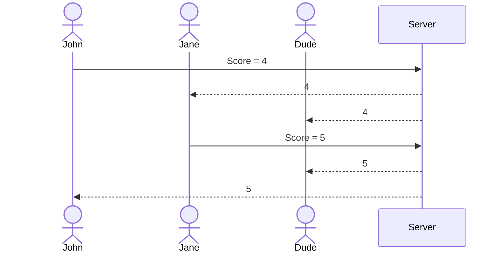

# Word-duh-le

[My Notes](notes.md)

Word-duh-le is a word guessing game where the player has to guess the hidden 5-letter word. With every guess more information is gained as to what letters are included in this 5-letter word. The player has 6 guesses before they fail. The amount of guesses correlates with your final score, the lower the better. All scores are stored in a leaderboard with all your friends! Who can get the lowest score!

## 🚀 Specification Deliverable

For this deliverable I did the following. I checked the box `[x]` and added a description for things I completed.

- [x] Proper use of Markdown
- [x] A concise and compelling elevator pitch
- [x] Description of key features
- [x] Description of how you will use each technology
- [x] One or more rough sketches of your application. Images must be embedded in this file using Markdown image references.

### Elevator pitch

Competative, quick, and skill-based. Word-duh-le is a brief strategy guessing game where the players try to guess a secret word within 6 guesses. The real key to this game is the idea that the lower the score the better you did, and that score is shared with all of your friends. Turning this game from casual to a competition as to who can get lower among all your friends. So whose the smartest?

### Design

Example walkthrough: John logs in with his username (John<3mom) and puts in his password. John has already been playing the game so he has friends and most of his friends have already played today's word-duh-le so they're already on the leaderboard. He then plays the game and gets a score of 4 today. The leaderboard places him in 4th with that score and the leaderboard gets updated for all his friends.

### Key features

- User login: This is so your profile can be shared and added among all your friends and also so you can keep a personal score online.
- Word Guessing Gameplay: This is the actual body of the game where the user has to guess the word within 6 guesses. All correctly placed letters will turn green to give hints. All incorrectly placed letters but letters still found in the word will turn yellow. Finally all letters that can't be found in the word will turn gray.
- Leaderboard: All scores will be place on the leaderboard with the lowest score being placed at the top.

### Technologies

I am going to use the required technologies in the following ways.

- **HTML** - Uses three HTML pages. One page for the user login, one for the actual Word-duh-le game, and the last for the leaderboard.
- **CSS** - Styling specifically on the game and leaderboard pages to make them look good. Also coloration and styling will also be applied to the guesses as the game goes on.
- **React** - Applies the logic to all the pages. Provides the login interface, the logic behind the Word-duh-le gameplay, displays the leaderboard, etc.
- **Service** - Submits final scores, retrieves leaderboard information, verifies and logs users into the accounts. Unable to store leaderboard information if the user isn't authenticated. 
- **DB/Login** - Stores user profiles along with all friend/leaderboard information. Also stores the word database so the secret word can be changed daily.
- **WebSocket** - After the user plays the game their score is placed on the leaderboard which updates all other users leaderboards.

## 🚀 AWS deliverable

For this deliverable I did the following. I checked the box `[x]` and added a description for things I completed.

- [ ] **Server deployed and accessible with custom domain name** - [My server link](https://yourdomainnamehere.click).

## 🚀 HTML deliverable

For this deliverable I did the following. I checked the box `[x]` and added a description for things I completed.

- [ ] **HTML pages** - I did not complete this part of the deliverable.
- [ ] **Proper HTML element usage** - I did not complete this part of the deliverable.
- [ ] **Links** - I did not complete this part of the deliverable.
- [ ] **Text** - I did not complete this part of the deliverable.
- [ ] **3rd party API placeholder** - I did not complete this part of the deliverable.
- [ ] **Images** - I did not complete this part of the deliverable.
- [ ] **Login placeholder** - I did not complete this part of the deliverable.
- [ ] **DB data placeholder** - I did not complete this part of the deliverable.
- [ ] **WebSocket placeholder** - I did not complete this part of the deliverable.

## 🚀 CSS deliverable

For this deliverable I did the following. I checked the box `[x]` and added a description for things I completed.

- [ ] **Visually appealing colors and layout. No overflowing elements.** - I did not complete this part of the deliverable.
- [ ] **Use of a CSS framework** - I did not complete this part of the deliverable.
- [ ] **All visual elements styled using CSS** - I did not complete this part of the deliverable.
- [ ] **Responsive to window resizing using flexbox and/or grid display** - I did not complete this part of the deliverable.
- [ ] **Use of a imported font** - I did not complete this part of the deliverable.
- [ ] **Use of different types of selectors including element, class, ID, and pseudo selectors** - I did not complete this part of the deliverable.

## 🚀 React part 1: Routing deliverable

For this deliverable I did the following. I checked the box `[x]` and added a description for things I completed.

- [ ] **Bundled using Vite** - I did not complete this part of the deliverable.
- [ ] **Components** - I did not complete this part of the deliverable.
- [ ] **Router** - I did not complete this part of the deliverable.

## 🚀 React part 2: Reactivity deliverable

For this deliverable I did the following. I checked the box `[x]` and added a description for things I completed.

- [ ] **All functionality implemented or mocked out** - I did not complete this part of the deliverable.
- [ ] **Hooks** - I did not complete this part of the deliverable.

## 🚀 Service deliverable

For this deliverable I did the following. I checked the box `[x]` and added a description for things I completed.

- [ ] **Node.js/Express HTTP service** - I did not complete this part of the deliverable.
- [ ] **Static middleware for frontend** - I did not complete this part of the deliverable.
- [ ] **Calls to third party endpoints** - I did not complete this part of the deliverable.
- [ ] **Backend service endpoints** - I did not complete this part of the deliverable.
- [ ] **Frontend calls service endpoints** - I did not complete this part of the deliverable.
- [ ] **Supports registration, login, logout, and restricted endpoint** - I did not complete this part of the deliverable.

## 🚀 DB deliverable

For this deliverable I did the following. I checked the box `[x]` and added a description for things I completed.

- [ ] **Stores data in MongoDB** - I did not complete this part of the deliverable.
- [ ] **Stores credentials in MongoDB** - I did not complete this part of the deliverable.

## 🚀 WebSocket deliverable

For this deliverable I did the following. I checked the box `[x]` and added a description for things I completed.

- [ ] **Backend listens for WebSocket connection** - I did not complete this part of the deliverable.
- [ ] **Frontend makes WebSocket connection** - I did not complete this part of the deliverable.
- [ ] **Data sent over WebSocket connection** - I did not complete this part of the deliverable.
- [ ] **WebSocket data displayed** - I did not complete this part of the deliverable.
- [ ] **Application is fully functional** - I did not complete this part of the deliverable.
